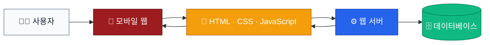

# 📱 KHU 모바일 웹서비스 프로그래밍

```mermaid
flowchart LR
    A["👨‍💻 사용자"] --> B["📱 모바일 웹"]
    B --> C["🎨 HTML · CSS · JavaScript"]
    C --> D["⚙️ 웹 서버"]
    D --> E[("🗄️ 데이터베이스")]

    D --> C
    C --> B

    style A fill:#f8fafc,stroke:#64748b,color:#0f172a
    style B fill:#9d1c20,stroke:#5c1013,color:#ffffff
    style C fill:#f59e0b,stroke:#b45309,color:#ffffff
    style D fill:#2563eb,stroke:#1e40af,color:#ffffff
    style E fill:#10b981,stroke:#047857,color:#ffffff
```
